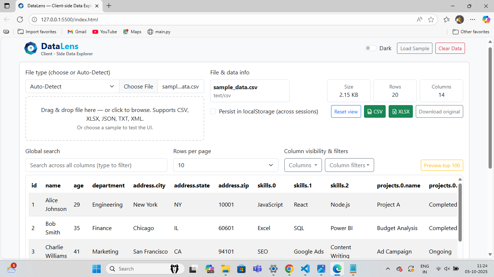

# DataLens – Client-Side Data Explorer

**DataLens** is a modern, frontend-only application to upload, explore, and visualize data from multiple file formats like CSV, JSON, Excel, TXT, and XML directly in your browser. No backend or server storage is required—everything runs client-side.

---

## Features

- **Multi-format File Upload**: Supports `.csv`, `.xlsx`, `.json`, `.txt`, `.xml` and more.
- **Client-side Parsing**: Files are parsed directly in the browser; no server needed.
- **Nested JSON Handling**: Automatically flattens nested objects and arrays for table display.
- **Interactive Table View**: Explore data with sorting, filtering, and column headers that reflect nested fields.
- **Theme Toggle**: Switch between light and dark modes.
- **Sample Data**: Load sample datasets to test the application.
- **Persistent Storage**: Optional storage using `localStorage`, can be cleared with one click.

---

## Demo



---

## Getting Started

### Prerequisites

- A modern web browser (Chrome, Firefox, Edge, Safari)
- No backend server is required.

### Installation

1. Clone the repository:
   ```bash
   git clone https://github.com/sachinkumar927/datalens.git
